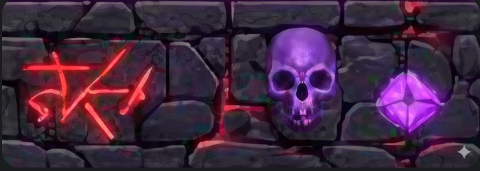
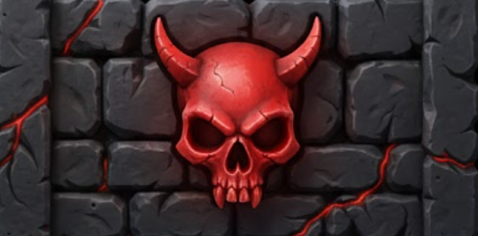
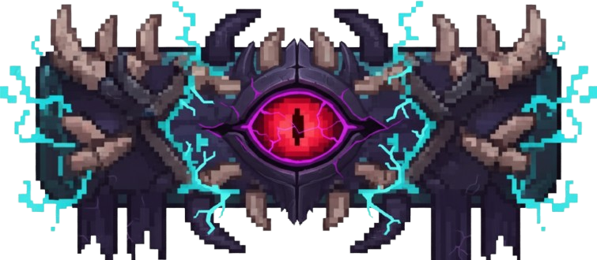

# Arkanoid Game - Dự án Lập trình Hướng Đối tượng

## 👥 Tác giả

**Group 10 - Class INT2204 7**

- Lê Trọng Thức - 24021637  
- [Họ tên 2] - [MSSV 2]
- [Họ tên 3] - [MSSV 3]
- [Họ tên 4] - [MSSV 4]

**Giảng viên lý thuyết:** Nguyễn Đức Anh  
**Giảng viên thực hành:** Vũ Đức Hiếu, Nguyễn Vũ Bình Dương  
**Học kỳ:** [HK1/HK2 - Năm học 2025-2026]

---

## 📖 Mô tả

Đây là một trò chơi **Arkanoid** kinh điển được phát triển bằng Java với JavaFX, là dự án cuối khóa của khóa học **Lập trình Hướng Đối tượng**. Dự án này trình bày việc triển khai các nguyên tắc OOP và kiến trúc phần mềm chuyên nghiệp.

### ✨ Các tính năng chính:

- ☕ Phát triển bằng **Java 17** với **JavaFX 21** cho giao diện đồ họa hiện đại
- 🎯 Triển khai đầy đủ các nguyên tắc OOP: **Đóng gói**, **Kế thừa**, **Đa hình** và **Trừu tượng hóa**
- 🏗️ Áp dụng **Design Patterns**: Singleton, Strategy, Observer
- ⚡ **Game loop 240Hz** với rendering 60 FPS cho gameplay mượt mà
- 🎨 Hệ thống **skin shop** với tiền tệ trong game (coins)
- 💾 Lưu trữ dữ liệu người chơi với **bảng xếp hạng Top 10**
- 🎵 Hệ thống âm thanh đầy đủ với background music và sound effects
- 🤖 **AI thông minh** với khả năng dự đoán quỹ đạo bóng

### 🎮 Các chế độ chơi:

1. **Singleplayer** - Chơi đơn với 9 level tăng dần độ khó
2. **Bot Mode** - Đối đầu với AI thông minh
3. **1v1 Mode** - Hai người chơi cùng máy (Player 1 vs Player 2)
4. **Endless Mode** - Sinh tồn với vô số level ngẫu nhiên

### 🎲 Cơ chế trò chơi:

- 🏓 Điều khiển paddle để bật bóng và phá hủy các viên gạch
- 🧱 **5 loại gạch** khác nhau:
  - Standard (1 hit) - Gạch thường
  - Multi-hit (3 hits) - Gạch cứng, đổi màu mỗi lần trúng
  - Indestructible - Gạch không thể phá hủy
  - Exploding - Gạch nổ, phá hủy gạch xung quanh
- 🎁 **3 loại Power-ups**:
  - MULTIPLY - Sinh thêm bóng
  - ONESHOT - Bóng phá gạch 1 phát
  - EXPAND - Paddle to ra 10 giây
- 💰 Kiếm coins để mua skin trong shop
- 📈 Hệ thống điểm số với bảng xếp hạng
- 🎵 Âm thanh sống động cho mọi hành động

---

## 📊 Sơ đồ UML

### Biểu đồ lớp


---

## 🏗️ Kiến trúc và Design Patterns

### Kiến trúc phân lớp (Layered Architecture)

```
Presentation Layer (UI)
    ├── MenuScreen, SettingScreen, ShopScreen
    ├── GameModeScreen, HighScoreScreen
    └── GameScreen (Singleplayer, Bot, 1v1, Endless)
           ↓
Business Logic Layer (Game Engine)
    ├── GameEngine - Vòng lặp game chính
    ├── LevelManager - Quản lý level
    ├── CollisionManager - Xử lý va chạm
    ├── AIManager - AI cho bot
    └── InputHandler - Xử lý input
           ↓
Service Layer (Managers)
    ├── SoundManager - Quản lý âm thanh
    ├── ScoreManager - Quản lý điểm số
    ├── CoinManager - Quản lý tiền tệ & shop
    ├── PowerUpManager - Quản lý power-ups
    └── BackgroundTaskManager - Xử lý task nền
           ↓
Data Layer (Persistence)
    ├── coins.properties - Lưu coins & skins
    └── highscores.dat - Lưu bảng xếp hạng
```

### Design Patterns được sử dụng

#### 1. 🔹 Singleton Pattern

**Mục đích:** Đảm bảo chỉ có một instance duy nhất trong toàn ứng dụng

**Được sử dụng trong:**
- `SoundManager` - Quản lý âm thanh toàn cục
- `BackgroundTaskManager` - Xử lý các task nền

**Ví dụ triển khai:**

```java
public class SoundManager {
    private static SoundManager instance;

    private SoundManager() {
        loadSoundEffects();
    }

    public static SoundManager getInstance() {
        if (instance == null) {
            instance = new SoundManager();
        }
        return instance;
    }
}
```

#### 2. 🔹 Strategy Pattern

**Mục đích:** Định nghĩa họ các thuật toán có thể hoán đổi cho nhau

**Được sử dụng trong:**
- `AIManager` - Các chiến thuật AI khác nhau:
  - Drift behavior (lang thang)
  - Track behavior (theo dõi bóng)
  - Powerup catching (bắt power-up)
  - Confusion state (bối rối khi nhiều bóng)

**Ví dụ:**
```java
// AIManager tự động chuyển đổi giữa các strategy
if (balls.isEmpty()) {
    handleDriftBehavior();  // Strategy 1
} else if (hasPowerup) {
    handlePowerupCatching(); // Strategy 2
} else {
    trackDangerousBall();    // Strategy 3
}
```

#### 3. 🔹 Observer Pattern

**Mục đích:** Thông báo tự động khi có thay đổi trạng thái

**Được sử dụng trong:**
- `ScoreManager` - Sử dụng `ObservableList` của JavaFX
  - Khi điểm thay đổi → UI tự động cập nhật
  - Không cần refresh thủ công

**Ví dụ:**
```java
private final ObservableList<Score> highScores;

public void addScore(String name, int points) {
    highScores.add(new Score(name, points));
    // UI tự động cập nhật TableView
}
```

#### 4. 🔹 State Pattern

**Mục đích:** Quản lý các trạng thái của game

**Các trạng thái:**
```java
public enum GameState {
    MENU,           // Màn hình menu
    GAME_MODE,      // Chọn chế độ chơi
    HIGH_SCORE,     // Bảng xếp hạng
    SETTING,        // Cài đặt
    SHOP,           // Cửa hàng skin
    START,          // Chuẩn bị bắt đầu
    PLAYING,        // Đang chơi
    PAUSED,         // Tạm dừng
    GAME_OVER,      // Kết thúc
    LEVEL_CLEARED   // Hoàn thành level
}
```

#### 5. 🔹 Template Method Pattern (Implicit)

**Được sử dụng trong:**
- `UIManager` - Lớp abstract cho tất cả các màn hình
- Các lớp con override `initializeUI()` để tạo UI riêng

---

## 🧵 Triển khai Đa luồng

Game sử dụng kiến trúc đa luồng để đảm bảo hiệu suất tối ưu:

| Luồng | Mục đích | Tần suất | Thư viện |
|-------|----------|----------|----------|
| **JavaFX Application Thread** | Render UI và xử lý events | 60 FPS | JavaFX |
| **Game Loop Thread** | Cập nhật logic game (vật lý, va chạm) | 240 Hz | AnimationTimer |
| **Audio Thread Pool** | Phát sound effects không đồng bộ | On-demand | AudioClip |
| **Background Task Thread** | Lưu/load file (coins, scores) | On-demand | BackgroundTaskManager |

### Tối ưu hóa Performance

```java
// Fixed timestep cho game logic ổn định
private static final double FIXED_TIME_STEP = 1.0 / 240.0;

// Frame time cho rendering
private static final long FRAME_TIME_NANOS = 16_666_667L; // ~60 FPS

// Batch processing để tránh ConcurrentModificationException
private final List<Ball> ballsToRemove = new ArrayList<>();
private final List<Brick> cachedBricks = new ArrayList<>();
```

---

## 🚀 Cài đặt

### Yêu cầu hệ thống:

- **Java:** 17 hoặc cao hơn
- **Maven:** 3.9+
- **IDE:** IntelliJ IDEA / Eclipse / NetBeans (khuyến nghị IntelliJ)
- **Hệ điều hành:** Windows, macOS, Linux

### Các bước cài đặt:

1. **Sao chép dự án từ kho lưu trữ:**
   ```bash
   git clone [repository-url]
   cd demo
   ```

2. **Mở dự án trong IntelliJ IDEA:**
   - File → Open → Chọn thư mục dự án
   - IntelliJ sẽ tự động nhận diện Maven project

3. **Cài đặt dependencies:**
   ```bash
   mvn clean install
   ```

4. **Chạy dự án:**

   **Cách 1 - Từ Maven:**
   ```bash
   mvn javafx:run
   ```

   **Cách 2 - Từ IDE:**
   - Mở file `src/main/java/main/MainLauncher.java`
   - Nhấn nút Run hoặc Shift+F10

   **Cách 3 - Build JAR file:**
   ```bash
   mvn clean package
   java -jar target/Arkanoid-1.0-SNAPSHOT.jar
   ```

### Troubleshooting:

**Lỗi "JavaFX runtime components are missing":**
```bash
# Windows
set PATH_TO_FX="C:\path\to\javafx-sdk\lib"
java --module-path %PATH_TO_FX% --add-modules javafx.controls,javafx.fxml,javafx.media -jar target/Arkanoid-1.0-SNAPSHOT.jar

# macOS/Linux
export PATH_TO_FX=/path/to/javafx-sdk/lib
java --module-path $PATH_TO_FX --add-modules javafx.controls,javafx.fxml,javafx.media -jar target/Arkanoid-1.0-SNAPSHOT.jar
```

---

## 🎮 Hướng dẫn chơi

### ⌨️ Điều khiển

#### Chế độ Singleplayer / Bot / Endless:

| Phím | Hành động |
|------|-----------|
| `←` hoặc `A` | Di chuyển paddle sang trái |
| `→` hoặc `D` | Di chuyển paddle sang phải |
| `SPACE` | Phóng bóng (khi bóng dính vào paddle) |
|  `ESC` | Tạm dừng game |

#### Chế độ 1v1 (Hai người chơi):

| Người chơi | Di chuyển trái | Di chuyển phải | Phóng bóng |
|------------|----------------|----------------|------------|
| **Player 1** (Dưới) | `A` | `D` | `SPACE` |
| **Player 2** (Trên) | `←` | `→` | `ENTER` |

### 📋 Cách chơi chi tiết

#### Bắt đầu game:

1. **Chọn chế độ chơi:**
   - Từ menu chính → "Game Mode"
   - Chọn: Singleplayer / Bot / 1v1 / Endless

2. **Singleplayer Mode (9 Levels):**
   - Phá hủy tất cả gạch có thể phá được
   - Hoàn thành level → tự động chuyển sang level tiếp theo
   - Hết mạng → Game Over
   - Mục tiêu: Hoàn thành cả 9 level với điểm cao nhất

3. **Bot Mode (Đấu với AI):**
   - Bạn ở dưới, Bot ở trên
   - Ai để bóng rơi qua paddle → đối thủ ghi điểm
   - Chơi đến 5 điểm thắng
   - AI có khả năng:
     - Dự đoán quỹ đạo bóng (kể cả bật tường)
     - Bắt power-up
     - Bối rối khi có nhiều bóng

4. **1v1 Mode (Hai người chơi):**
   - Tương tự Bot Mode nhưng cả 2 đều người chơi
   - Player 1 dùng A/D và SPACE
   - Player 2 dùng ←/→ và ENTER
   - Chơi đến 5 điểm thắng

5. **Endless Mode:**
   - Không có điểm dừng
   - Level sinh ngẫu nhiên vô hạn
   - Độ khó tăng dần theo level
   - Mục tiêu: Sống sót lâu nhất và ghi điểm cao nhất

#### Gameplay Tips:

- 🎯 **Góc phản xạ:** Bóng chạm rìa paddle → góc lệch nhiều, chạm giữa → góc thẳng
- 💡 **Power-up Priority:** EXPAND > ONESHOT > MULTIPLY
- 🧱 **Exploding Brick:** Phá vỡ tạo chuỗi nổ → điểm cao
- 🎵 **Âm thanh:** Mỗi loại va chạm có âm thanh riêng để nhận biết

---

## 🎁 Hệ thống Power-ups

Power-ups rơi ngẫu nhiên khi phá gạch (25% chance). Bắt bằng paddle để kích hoạt.

| Hình ảnh | Tên | Tác dụng | Thời gian | Icon |
|----------|-----|----------|-----------|------|
|  | **MULTIPLY** | Sinh thêm 1 bóng từ vị trí bóng hiện tại | Vĩnh viễn | 🎯 |
|  | **ONESHOT** | Bóng phá mọi gạch 1 hit (trừ Indestructible) | 1 lần | ⚡ |
|  | **EXPAND** | Paddle tăng kích thước lên 50% | 10 giây | 🛡️ |

### Chi tiết Power-up:

**MULTIPLY (Nhiều bóng):**
- Tạo thêm bóng giúp phá gạch nhanh hơn
- Có thể stack nhiều bóng
- ⚠️ Nguy hiểm: Khó kiểm soát nhiều bóng cùng lúc

**ONESHOT (Một phát):**
- Bóng đổi skin thành bóng vàng sáng
- Phá gạch 2-hit và 3-hit chỉ 1 phát
- Gạch Exploding vẫn nổ bình thường
- Kết thúc sau khi phá 1 gạch hoặc chạm paddle

**EXPAND (Mở rộng):**
- Paddle dài hơn → dễ bắt bóng
- Timer hiển thị trên màn hình
- Hết thời gian → paddle trở về kích thước ban đầu

---

## 🏆 Hệ thống tính điểm

### Điểm cơ bản:

| Hành động | Điểm |
|-----------|------|
| Phá Standard Brick (1 hit) | 10 điểm |
| Phá Multi-Hit Brick (3 hits) | 20 điểm |
| Phá Exploding Brick | 50 điểm |
| Bắt Power-up | 50 điểm |
| Hoàn thành level | 1000 điểm + Bonus |

### Hệ thống Coins:

| Nguồn | Coins |
|-------|-------|
| Phá 1 brick | 1 coin |
| Hoàn thành level | 50 coins |
| Bắt power-up | 5 coins |

**Sử dụng coins trong Shop để mua:**
- Paddle Skins: 100-500 coins
- Ball Skins: 100-500 coins

---

## 🧱 Các loại Brick

| Loại | Hình ảnh | Hits | Đặc điểm | Điểm |
|------|----------|------|----------|------|
| **Standard** |  | 1 | Gạch thường, dễ phá | 100 |
| **Multi-Hit** |  | 3 | Đổi màu mỗi lần hit:<br>🔴 Red (3) → 🟠 Orange (2) → 🟡 Yellow (1) | 300 |
| **Indestructible** |  | ∞ | Không thể phá hủy, bóng bật lại | 0 |
| **Exploding** |  | 1 | Nổ khi bị phá, phá hủy gạch xung quanh (radius 1) | 500 + chain |

### Level Design:

Game có **9 levels**:

```
levels/
├── level1.txt  - Đơn giản, làm quen
├── level2.txt  - Thêm Multi-Hit bricks
├── level3.txt  - Xuất hiện Indestructible walls
├── level4.txt  - Pattern phức tạp
├── level5.txt  - Exploding bricks
├── level6.txt  - Kết hợp nhiều loại
├── level7.txt  - Độ khó cao
├── level8.txt  - Challenge
└── level9.txt  - Boss level
```

**Format file level:**
```
11111111111111  (1 = Standard brick)
22222222222222  (2 = Multi-Hit brick)
U1U1U1U1U1U1U1  (U = Indestructible)
BBBBB11BBBBBB1  (B = Exploding brick)
00011111110000  (0 = Empty space)
```

---

## 🎨 Hệ thống Shop & Skins

### Shop Categories:

1. **Paddle Skins** (3 skins):
   - Default (miễn phí)
   - Skin 1 (100 coins)
   - Skin 2 (200 coins)

2. **Ball Skins** (4 skins):
   - Default (miễn phí)
   - Oneshot (hiển thị khi có power-up)
   - Skin 1 (100 coins)
   - Skin 2 (200 coins)

### Tính năng Shop:

- ✅ Lưu trữ vĩnh viễn (không mất khi tắt game)
- ✅ Preview skin trước khi mua
- ✅ Hiển thị coins hiện có
- ✅ Chặn mua lại skin đã sở hữu
- ✅ Apply skin ngay lập tức

---

## 🖼️ Screenshots & Demo

### Menu chính


### Preview Tuần 1 - Gameplay cơ bản

https://github.com/user-attachments/assets/7a21ead9-b33f-4a71-8542-327b96e43b82

### Preview Tuần 2 - Tính năng hoàn chỉnh

https://github.com/user-attachments/assets/9f58c691-46c4-4651-9a3d-10abe993b4d0

### Preview game hoàn chỉnh

Em bình quay video reviewveef game rồi thêm vô đây

### Các chế độ chơi

**Singleplayer Mode:**
- 9 levels với độ khó tăng dần
- Màn hình pause, game over
- Level transition với fade effect

**Bot Mode:**
- AI thông minh ở phía trên
- Điểm số hiển thị rõ ràng
- AI có indicator chỉ hướng

**1v1 Mode:**
- 2 paddles, 2 players
- Split controls
- First to 5 wins

**Endless Mode:**
- Random level generation
- Vô hạn levels
- Progressive difficulty

---

## 🛠️ Công nghệ sử dụng

| Công nghệ | Phiên bản | Mục đích |
|-----------|-----------|----------|
| **Java** | 17 | Ngôn ngữ lập trình cốt lõi |
| **JavaFX** | 21.0.6 | Framework GUI (controls, media, fxml) |
| **Maven** | 3.9+ | Build tool và dependency management |
| **JUnit Jupiter** | 5.12.1 | Unit testing framework |
| **Java Properties** | Built-in | Lưu trữ coins và settings |
| **Java Serialization** | Built-in | Lưu trữ high scores |

### Dependencies trong pom.xml:

```xml
<dependencies>
    <!-- JavaFX Core -->
    <dependency>
        <groupId>org.openjfx</groupId>
        <artifactId>javafx-controls</artifactId>
        <version>21.0.6</version>
    </dependency>

    <!-- JavaFX FXML (UI Builder) -->
    <dependency>
        <groupId>org.openjfx</groupId>
        <artifactId>javafx-fxml</artifactId>
        <version>21.0.6</version>
    </dependency>

    <!-- JavaFX Media (Audio/Video) -->
    <dependency>
        <groupId>org.openjfx</groupId>
        <artifactId>javafx-media</artifactId>
        <version>21.0.6</version>
    </dependency>

    <!-- JUnit 5 for Testing -->
    <dependency>
        <groupId>org.junit.jupiter</groupId>
        <artifactId>junit-jupiter-api</artifactId>
        <version>5.12.1</version>
        <scope>test</scope>
    </dependency>
</dependencies>
```

---

## 🧪 Testing

### Chạy Unit Tests:

```bash
# Chạy tất cả tests
mvn test

# Chạy test cụ thể
mvn test -Dtest=BackgroundTaskManagerTest

# Chạy với verbose output
mvn test -X
```

### Test Coverage:

```bash
# Generate coverage report
mvn jacoco:report

# Xem report tại:
# target/site/jacoco/index.html
```

### Các test case hiện có:

- ✅ `BackgroundTaskManagerTest` - Test Singleton pattern và async tasks
- 📝 *Có thể mở rộng thêm tests cho các managers khác*

---

## 🎵 Hệ thống âm thanh

### Sound Effects (12 loại):

| Event | File | Mô tả |
|-------|------|-------|
| Bóng chạm paddle | `paddle_hit.wav` | Click ngắn |
| Bóng trúng gạch | `brick_hit.wav` | Tap nhẹ |
| Gạch vỡ | `brick_break.wav` | Crash |
| Bóng chạm tường | `wall_hit.wav` | Boing |
| Power-up xuất hiện | `powerup_spawn.wav` | Sparkle |
| Bắt power-up | `powerup_collect.wav` | Ding |
| Exploding brick | `explosion.wav` | Boom |
| Click button | `button_click.wav` | Click UI |
| Hoàn thành level | `level_complete.wav` | Fanfare |
| Game over | `game_over.wav` | Sad trombone |

### Background Music:

- **Menu:** `menu_music.mp3` - Nhạc ambient nhẹ nhàng
- **Gameplay:** `game_music.mp3` - Nhạc upbeat kịch tính

### Tính năng SoundManager:

- ✅ **Singleton pattern** - Một instance duy nhất
- ✅ **Volume control** - Điều chỉnh âm lượng riêng cho SFX và Music
- ✅ **Mute toggle** - Tắt/bật âm thanh
- ✅ **Audio pooling** - Phát nhiều SFX cùng lúc không bị chồng chéo
- ✅ **Music looping** - Background music tự động lặp lại

---

## 🔮 Tính năng nổi bật

### 1. AI thông minh (AIManager)

**Khả năng:**
- 🎯 **Dự đoán quỹ đạo bóng** - Tính toán vị trí bóng rơi, kể cả sau khi bật tường
- 🎁 **Bắt power-up** - Ưu tiên bắt power-up khi gần
- 😵 **Confusion state** - Bối rối khi có nhiều bóng (≥2), di chuyển random
- 🚶 **Drift behavior** - Lang thang khi không có bóng
- 🎲 **Mistake simulation** - Cố tình sai lệch để không quá khó

**Code highlights:**
```java
private static final double MISTAKE_FACTOR = 0.4;
private static final double CONFUSION_CHANCE = 0.10;
private static final int CONFUSION_DURATION_FRAMES = 60;
```

### 2. Physics engine chính xác

**Collision detection:**
- AABB (Axis-Aligned Bounding Box) cho hiệu suất cao
- Overlap resolution để tránh bóng "chui" vào object
- Góc phản xạ động dựa vào vị trí va chạm

**Ball reflection formula:**
```java
// Góc phản xạ = Góc tới + Offset dựa vào vị trí chạm
double hitPosition = (ballX - paddleCenterX) / (paddleWidth / 2.0);
double angleOffset = hitPosition * MAX_ANGLE_OFFSET;
```

### 3. Scalable resolution

- Hỗ trợ nhiều độ phân giải
- UI scale tự động với `UI_SCALE_X`, `UI_SCALE_Y`
- Base resolution: 1280x720

### 4. Smooth animations

- Fade transitions giữa các màn hình
- Power-up timer với animation
- Ball trail effect (có thể mở rộng)

### 5. Save system

**Persistent data:**
- `coins.properties` - Lưu coins, skins đã mua, skin đang dùng
- `highscores.dat` - Lưu top 10 điểm cao nhất
- Auto-save sau mỗi transaction

---

## 📝 Nguyên tắc OOP được áp dụng

### 1. Đóng gói (Encapsulation)

**Ví dụ:**
```java
public class Ball {
    private double x, y;           // Private fields
    private double velocityX, velocityY;

    public double getX() { return x; }  // Getter
    public void setX(double x) {        // Setter với validation
        this.x = Math.max(0, Math.min(x, GAME_WIDTH));
    }
}
```

### 2. Kế thừa (Inheritance)

**Hierarchy:**
```
GameObject (abstract)
    ├── Ball
    ├── Paddle
    ├── Powerup
    └── Brick (abstract)
            ├── StandardBrick
            ├── MultiHitBrick
            ├── IndestructibleBrick
            └── ExplodingBrick
```

**Ví dụ:**
```java
public abstract class Brick extends GameObject {
    protected int hitCount;
    public abstract int hit();  // Mỗi loại gạch hit() khác nhau
}

public class StandardBrick extends Brick {
    @Override
    public int hit() {
        return destroy() ? 100 : 0;
    }
}
```

### 3. Đa hình (Polymorphism)

**Runtime polymorphism:**
```java
List<Brick> bricks = new ArrayList<>();
bricks.add(new StandardBrick());
bricks.add(new MultiHitBrick());
bricks.add(new ExplodingBrick());

for (Brick brick : bricks) {
    brick.hit();  // Gọi method khác nhau tùy loại gạch
}
```

**Method overriding:**
```java
// UIManager
protected abstract void initializeUI();

// MenuScreen
@Override
protected void initializeUI() {
    // Menu-specific UI
}
```

### 4. Trừu tượng hóa (Abstraction)

**Abstract classes:**
- `GameObject` - Base cho mọi game entity
- `Brick` - Base cho các loại gạch
- `UIManager` - Base cho màn hình UI
- `GameScreen` - Base cho gameplay screens

**Interfaces (implicit):**
- `Runnable` - Callbacks cho buttons
- `Consumer<T>` - Callbacks với tham số

---

## 🏅 Điểm mạnh của dự án

✅ **Kiến trúc rõ ràng** - Phân lớp logic, UI, service tách biệt  
✅ **Code quality** - Comments chi tiết bằng tiếng Việt, dễ hiểu  
✅ **Performance** - Game loop 240Hz, batch processing, caching  
✅ **Extensibility** - Dễ thêm brick mới, power-up mới, game mode mới  
✅ **User experience** - Smooth animations, sound feedback, intuitive UI  
✅ **Testing** - Có unit tests, có thể mở rộng  
✅ **Documentation** - README chi tiết, code comments đầy đủ  

---

## 📜 Giấy phép

Dự án này được phát triển **chỉ nhằm mục đích giáo dục** trong khuôn khổ môn học Lập trình Hướng đối tượng.

## 📝 Ghi chú

- 📚 Trò chơi được phát triển như một phần của chương trình giảng dạy **Lập trình Hướng đối tượng với Java**
- 👨‍💻 Tất cả mã đều được các thành viên trong nhóm viết dưới sự hướng dẫn của giảng viên
- 🎨 Assets (hình ảnh, âm thanh) được sử dụng cho mục đích giáo dục theo quy định sử dụng hợp lý
- 🎯 Dự án chứng minh ứng dụng thực tế của:
  - Các nguyên tắc OOP (Encapsulation, Inheritance, Polymorphism, Abstraction)
  - Design Patterns (Singleton, Strategy, Observer, State)
  - Clean Code principles
  - Layered Architecture
  - JavaFX GUI development
  - Game development concepts


